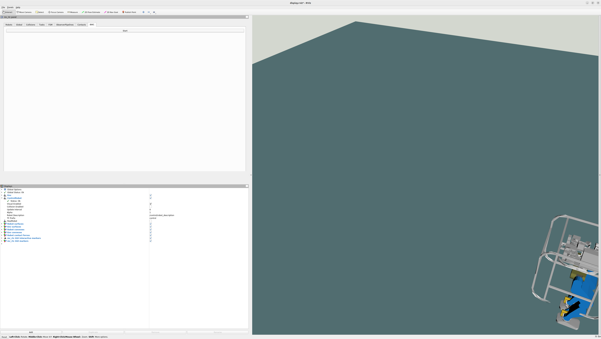
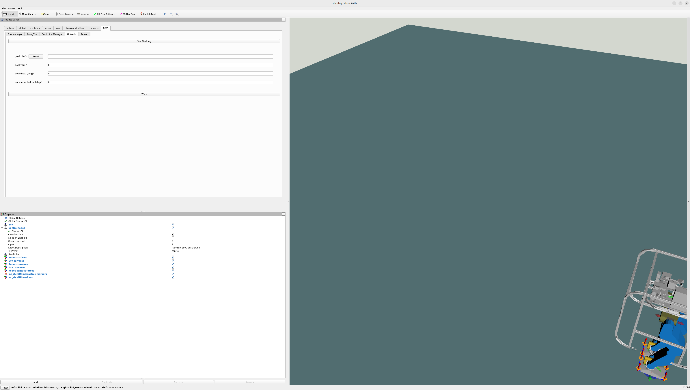

# MC_RTCの使い方　How to use MC_RTC

## 目次
- [CHIDORIを動かすまで](#chidoriを動かすまで)
  - [mc_rtcのコンテナを起動させる](#mc_rtcのコンテナを起動させる)
  - [ROSマスターを実行](#rosマスターを実行)
  - [choreonoid起動](#choreonoid起動)
  - [RVIZ起動](#rviz起動)
  - [実際に歩かせる](#実際に歩かせる)
- [ログ](#ログ)
  - [mc_rtcのログの取り方](#mc_rtcのログの取り方)
  - [運動量のログの取り方](#運動量のログの取り方)
  - [運動量のログの見方](#運動量のログの見方-編集中)
- [歩行パラメータの設定](#歩行パラメータの設定)
- [沈む床のシミュレーション](#沈む床のシミュレーション)
  - [沈む床の実装](#沈む床の実装)
  - [階段昇降](#階段昇降)
## CHIDORIを動かすまで
### mc_rtcのコンテナを起動させる。
```bash
cd ~/irsl_mc_rtc
ROBOT=CHIDORI ./run.sh
```
### ROSマスターを実行
```bash
roscore
```

### choreonoid起動
別のターミナルを開き、そこから同様にコンテナにアクセスし、choreonoidを起動させる。
```bash
cd ~/irsl_mc_rtc

# コンテナ起動
./exec.sh

# 起動ファイルの階層に移動
cd ../mc_rtc_ws/install/share/hrpsys/samples/CHIDORI

# choreonoid起動
choreonoid sim_mc.cnoid --start-simulation
```

### RVIZ起動
choreonoidの手順と同様、別のターミナルを開き、そこから同様にコンテナにアクセスし、RVIZを起動させる。
```bash
cd ~/irsl_mc_rtc

# コンテナ起動
./exec.sh

# RVIZ起動
roslaunch mc_rtc_ticker display.launch
```

### 実際に歩かせる
CHIDORIを歩かせるためのソフトウェアをあらかた起動できたら、実際に歩かせてみる。\
* RVIZのタブのBWC(BaselineWalkingController)をクリック。\
\

* スタートボタンを押し、"GuiWalk"タブをクリック\
\

* "StepWalking"ボタンをクリックし、歩行させたい方向のパラメータを入力後、"Start"ボタンをクリック。\
x軸方向に2m前進させるには画像のように入力すれば良い\
\


## ログ
### mc_rtcのログの取り方
mc_rtcのログのとり方を示す。\
まずはログの取得に必要なフォルダをダウンロードする。今回は /userdir/~ に格納することにする。
> https://github.com/IRSL-tut/log_format
```
.
└── userdir/
    └── log_plotter
```
さらに今回ログを保存するフォルダを以下の階層に作成する。
```
.
└── userdir/
    ├── log_plotter
    └── chidori_LOG/
        ├── bins
        └── converted_bins
```
chidoriのシミュレーションを行うと~.binファイルが作成される。ファイルの出力先はmc_rtc.yamlで変更可能である。\
今回はchidori_LOG/binsに保存する。
```
.
└── root/
    └── .config/
        └── mc_rtc/
            └── mc_rtc.yaml
```
```yaml:mc_rtc.yaml
MainRobot: CHIDORI

Enabled: BaselineWalkingController
ControllerModulePaths: ["/bwc_ws/devel/.private/baseline_walking_controller/lib/mc_controller/"]
LogDirectory: /userdir/chidori_LOG/bins

Timestep: 0.002
```
次にbinファイルを読み取れるようにlog_converterを使ってコンバートする。この時にbinファイルのパスと、出力先を記入する。今回はchidori_LOG/converted_binsに出力する。
```bash
python3 /userdir/log_format/log_converter.py -f /userdir/chidori_LOG/bins/mc-control-BaselineWalkingController-latest.bin -d /userdir/chidori_LOG/converted_bins/
```
コンバートしたファイルを使用して、グラフを表示するには、以下のコマンドを入力する。
```bash
datalogger_plotter_with_pyqtgraph.py --start 000 --length 80000  --plot /userdir/log_format/config/mc_rtc_plot.yaml --layout /userdir/log_format/config/chidori_com_zmp_layout.yaml -f /userdir/chidori_LOG/converted_bins/mc-control-BaselineWalkingController-latest
```

### 運動量のログの取り方
運動量のログを取る際に必要なpythonファイルをダウンロードする。\
※現在githubにあがっていないため、以下にコードを示す。ログファイルの出力先は各自で記入し直すこと。ここでは"userdir/chidori_LOG/logs"ディレクトリに出力するようにする。
```
.
└── userdir/
    ├── log_plotter
    ├── chidori_LOG/
    │   ├── bins
    │   ├── converted_bins
    │   └── logs
    └── add_log.py
```


```python:add_log.py
#!/usr/bin/env python
# -*- coding: utf-8 -*-

from cnoid.Base import *
from cnoid.BodyPlugin import *
from datetime import datetime as dt

#現在時刻文字列取得
tdatetime = dt.now()
tstr = tdatetime.strftime('%Y%m%d-%H%M%S')

# WorldItem取得(名前決め打ちなのがスマートではない)
world = RootItem.instance.findItem('World')

# WorldLogFile生成
worldlog = WorldLogFileItem()
worldlog.setChecked(True)

# ログファイル出力
worldlog.setLogFile('/raw_log_data/cnoid-{}.log'.format(tstr))

worldlog.setRecordingFrameRate(0)

# Worldへ追加
world.addChildItem(worldlog)
```

ログを取る際は、choreonoid起動時に以下のように、add_log.pyも実行するようにする。
```
choreonoid sim_mc.cnoid --python /userdir/add_log.py --start-simulation
```

### 運動量のログの見方 ※編集中
今回はirsl_docker_irsl_systemを利用してログを確認する。まずはjupyterを起動し、
```
cd ~/irsl_docker_irsl_system
./run.sh jupyter --pull --mount "-v /home/irsl/irsl_mc_rtc:/irsl_mc_rtc"
```
http://localhost:8888 にアクセスする。
新規で作成する際は、オレンジ色のchoreonoidと書かれたボタンをクリックする。そこで以下のコードを実行する。
```python
prefix='mc-control-BaselineWalkingController-latest'
filedir='/irsl_mc_rtc/userdir/chidori_LOG/converted_bins'
model_path="/irsl_mc_rtc/userdir/CHIDORI/CHIDORI/model/CHIDORImain.wrl"

exec(open('/choreonoid_ws/install/share/irsl_choreonoid/sample/irsl_import.py').read())
exec(open('/irsl_mc_rtc/userdir/log_format/plot_using_model.py').read())

import traceback

try:
    setupRobot(modelFile=model_path)
except TypeError as e:
    print("TypeError encountered:")
    traceback.print_exc()

setupRobot(modelFile=model_path)
dumpLogFiles(prefix, directory=filedir, robot=robot_c)
exec(open('/irsl_mc_rtc/userdir/log_format/cnoid_log_parser.py').read())
```
そのあと、ターミナルで実行すれば出力される。
```
python3 datalogger_plotter_with_pyqtgraph.py --start 000 --length 80000 --plot ../../../log_format/config/mc_rtc_plot.yaml --layout /home/irsl/irsl_mc_rtc/userdir/log_format/config/chidori_com_zmp_layout.yaml -f /home/irsl/irsl_mc_rtc/userdir/chidori_LOG/converted_bins/
```


## 歩行パラメータの設定

ここでは、CHIDORIの歩行に関わるパラメータの変更方法を示す。\
まず、CHIDORIの歩行パラメータは"./mc_rtc_ws/install/lib/mc_controller/BaselineWalkingController/chidori.yaml"に格納されている。
中身は以下のようになっており、各々のパラメータを変更することで歩行の仕方をカスタマイズすることができる。
```yaml:chidori.yaml
CoMTask:
  activeJoints: [
  "Root",
  "LLEG_JOINT0", "LLEG_JOINT1", "LLEG_JOINT2", "LLEG_JOINT3", "LLEG_JOINT4", "LLEG_JOINT5", 
  "RLEG_JOINT0", "RLEG_JOINT1", "RLEG_JOINT2", "RLEG_JOINT3", "RLEG_JOINT4", "RLEG_JOINT5"]

BaseOrientationTask:
  frame: BODY

FootManager:
  footstepDuration: 0.9 # [sec]
  doubleSupportRatio: 0.15 # []
  impedanceGains:
    SingleSupport:
      spring:
        linear: [2250, 2250, 450] # Weaken Z-component spring to avoid a too fast recovery for mass errors

CentroidalManager:
  useActualStateForMpc: true
  enableZmpFeedback: false
  useTargetPoseForControlRobotAnchorFrame: true
  useActualComForWrenchDist: false
  # enableComZFeedback: false
  dcmGainP: 2.0 # It must be greater than 1 to be stable
  comZGainP: 20000.0
  zmpVelGain: 0.02
  refComZ: 0.7039 # [m]
  method: PreviewControlZmp
  horizonDuration: 2.0 # [sec]
  horizonDt: 0.002 # [sec]
  # method: IntrinsicallyStableMpc
  # horizonDuration: 2.0 # [sec]
  # horizonDt: 0.02 # [sec]
```
よく使う項目を２つあげる。

### footstepDuration
一歩にかかる時間
### doubleSupportRatio
一歩の中で両足が付いている時間の割合

## 沈む床のシミュレーション

ここでは、沈む床のシミュレーション環境を実装し、CHIDORIに階段昇降の動作を行わせる方法を示す。

### 沈む床の実装 (※編集中)
沈む床を実装するにあたって、データを以下からダウンロードする。
> https://github.com/IRSL-tut/cnoid_spring_customizer.git
※(途中)sim_mc_step.cnoidのダウンロード先を調べる

ダウンロードしたら、セットアップを行う。以下のコマンドを実行する。

```bash
cp sim_mc_step.cnoid /mc_rtc_ws/install/share/hrpsys/samples/CHIDORI

cd ~/cnoid_spring_customizer/build
make
make install

export SPRING_CUSTOMIZER_ROBOT=step_floor
export SPRING_CUSTOMIZER_CONF_FILE=/userdir/cnoid_spring_customizer/sample/SpringCustomizerSettings.yaml
```

実行する際は、以下のコマンドを実行する。
```bash
cd /mc_rtc_ws/install/share/hrpsys/samples/CHIDORI
choreonoid sim_mc_step.cnoid --python /userdir/add_log.py --start-simulation
```

### 階段昇降
沈む床を歩かせるとき、CHIDORIに階段を登る動作をさせるのが有効である。今回はCHIDORIに階段昇降を行えるようにする。
まずCHIDORIの階段昇降を行うためのパラメータを格納したファイル"BaselineWalkingController.yaml"を作成する。
```yaml:BaselineWalkingController.yaml
FootManager:
  footstepDuration: 1.2 # [sec]
  doubleSupportRatio: 0.2 # []

CentroidalManager:
  refComZ: 0.81 # [m]

transitions:
  - [BWC::Initial_, OK, BWC::ConfigWalk_, Auto]

states:
  BWC::Initial_:
    base: BWC::Initial
    configs:
      autoStartTime: 2.0

  BWC::ConfigWalk_:
    base: BWC::ConfigWalk
    configs:
      footstepList:
        # 1歩目: 左足を前に出す（歩幅を0.4メートルに設定）
        - foot: Left
          footMidpose:
            translation: [0.4, 0.0, 0.0] # x軸方向に0.4メートル
          startTime: 2.0
          swingTrajConfig:
            type: CubicSplineSimple
            withdrawOffset: [0, 0, 0.05]
            approachOffset: [0, 0, 0.02]
            swingOffset: [0, 0, 0.05]

        # 2歩目: 右足を前に出す（右足を垂直に下ろすように調整）
        - footMidpose:
            translation: [0.4, 0.0, 0.0] # 同じくx軸方向に0.4メートル
          swingTrajConfig:
            type: CubicSplineSimple
            withdrawOffset: [0, 0, 0.18] # 足を高く持ち上げる
            approachOffset: [0, 0, 0.02]
            swingOffset: [0, 0, 0.18] # 足を垂直に降ろす

        # 3歩目: 左足で段差を上る（x軸方向にさらに前進し、z軸方向の高さを下げる、歩幅を0.45に調整）
        - footMidpose:
            translation: [0.85, 0.0, 0.1] # x軸方向に0.85メートル進み、z軸方向に0.1メートル
          swingTrajConfig:
            type: CubicSplineSimple
            withdrawOffset: [0, 0, 0.08]
            approachOffset: [0, 0, 0.02]
            swingOffset: [0, 0, 0.08]

        # 4歩目: 右足を段差に揃える（右足を垂直に下ろすように調整）
        - footMidpose:
            translation: [0.85, 0.0, 0.095] # 右足も同じく段差に揃える
          swingTrajConfig:
            type: CubicSplineSimple
            withdrawOffset: [0, 0, 0.18] # 足を高く持ち上げる
            approachOffset: [0, 0, 0.02]
            swingOffset: [0, 0, 0.18] # 足を垂直に降ろす

        # 5歩目: 左足でさらに段差を上る（歩幅を0.45に調整）
        - footMidpose:
            translation: [1.30, 0.0, 0.1] # x軸方向に1.30メートル進み、z軸方向に0.1メートル
          swingTrajConfig:
            type: CubicSplineSimple
            withdrawOffset: [0, 0, 0.08]
            approachOffset: [0, 0, 0.02]
            swingOffset: [0, 0, 0.08]

        # 6歩目: 右足を段差に揃える（右足を垂直に下ろすように調整）
        - footMidpose:
            translation: [1.30, 0.0, 0.095] # 右足も同じく段差に揃える
          swingTrajConfig:
            type: CubicSplineSimple
            withdrawOffset: [0, 0, 0.18] # 足を高く持ち上げる
            approachOffset: [0, 0, 0.02]
            swingOffset: [0, 0, 0.18] # 足を垂直に降ろす

        # 7歩目: 左足でさらに段差を上る（歩幅を0.45に調整）
        - footMidpose:
            translation: [1.75, 0.0, 0.1] # 左足をさらに段差を上る (x軸方向に1.75メートル、z軸は0.1メートル)
          swingTrajConfig:
            type: CubicSplineSimple
            withdrawOffset: [0, 0, 0.08] # 左足も高めに持ち上げる
            approachOffset: [0, 0, 0.02]
            swingOffset: [0, 0, 0.08]

        # 8歩目: 右足を段差に揃える（右足を垂直に下ろすように調整）
        - footMidpose:
            translation: [1.75, 0.0, 0.095] # 右足も同じく段差に揃える
          swingTrajConfig:
            type: CubicSplineSimple
            withdrawOffset: [0, 0, 0.18] # 足を高く持ち上げる
            approachOffset: [0, 0, 0.02]
            swingOffset: [0, 0, 0.18] # 足を垂直に降ろす
```
今設定してあるパラメータは、今回実装した沈み込む床を歩くためのパラメータに設定してある。
作成できたら、以下の階層にコピーする。
```bash
cp ~/BaselineWalkingController.yaml /root/.config/mc_rtc/controllers/
```
これでchoreonoidを実行すればシミュレーションが始まる。
（注意）この階層にファイルをおいた場合、CHIDORIが階段昇降をデフォルトで行うようになる。このとき、RVIZで歩幅などは設定する必要はなく、自動でシミュレーションがスタートする。


